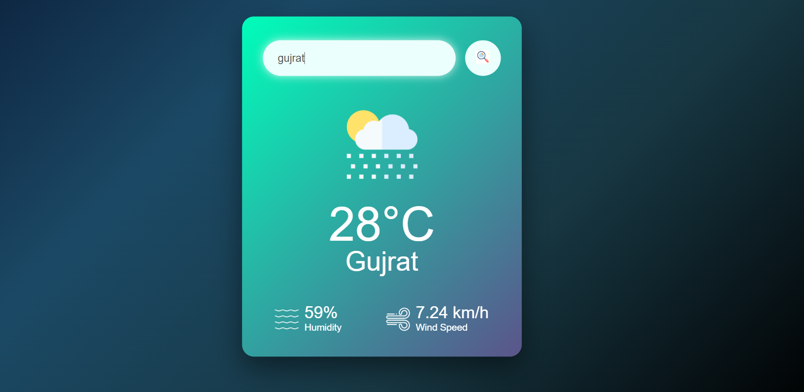

# 🌦️ Weather App

A responsive Weather App built using **HTML, CSS, and JavaScript**. It fetches real-time weather data using the **OpenWeatherMap API** and displays temperature, humidity, wind speed, and weather icons.

---

## 🚀 Features

- 🌍 Search weather by city
- 🌡️ Real-time temperature
- 💧 Humidity
- 🌬️ Wind Speed
- 🌞 Day & 🌙 Night weather icons
- 📱 Responsive UI
- ❌ Invalid city handling
- ✨ Smooth hover effects

---

## 🛠 Tech Stack

- HTML5
- CSS3
- JavaScript
- OpenWeatherMap API

---

## 📸 Screenshots

### Home Page

<p align="center">

</p>

### Weather Result

<p align="center">

</p>

---

## 📂 Folder Structure

```text
Weather-App/
│
├── img/
├── screenshots/
│   ├── homepage.png
│   └── result.png
├── index.html
├── style.css
├── script.js
└── README.md
```

---

## ⚙️ Installation

```bash
git clone https://github.com/Vaishnaviiii2/Weather-App.git
```

Open `index.html` in your browser.

---

## 🌐 API

OpenWeatherMap API

https://openweathermap.org/api

---

## 👩‍💻 Author

**Vaishnavi Wanjare**
